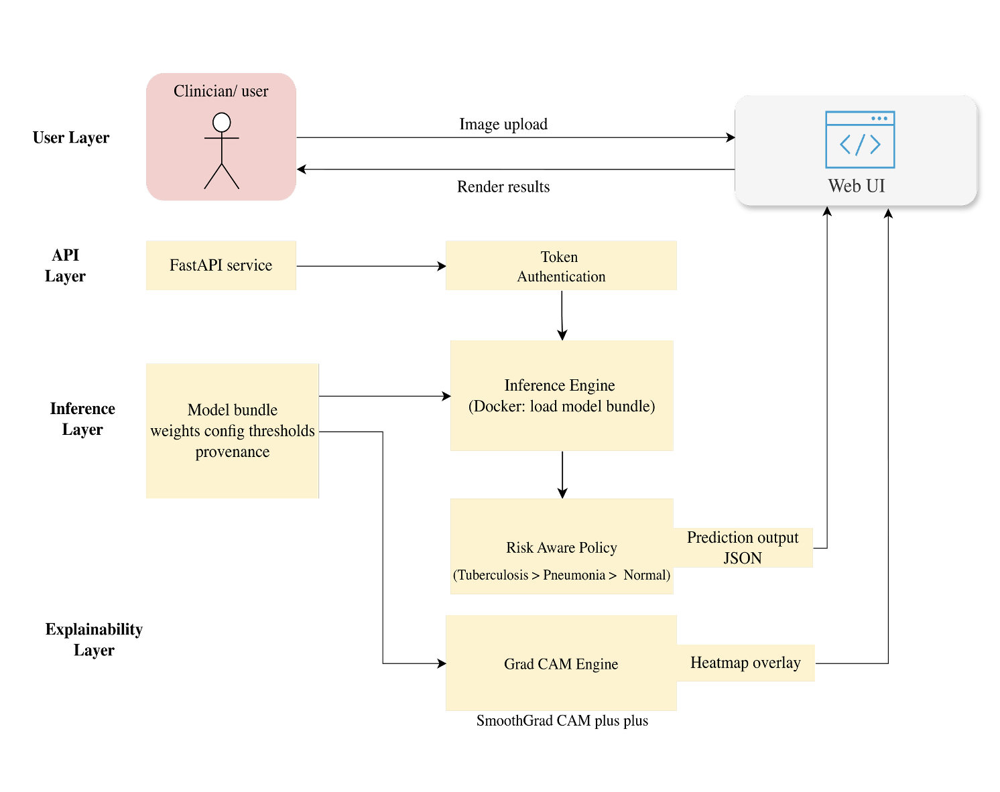

# 🩻 Chest X-Ray Disease Classification

This repository implements an end-to-end medical imaging pipeline for Chest X-ray multi-class classification (Normal / Pneumonia / Tuberculosis), covering:
- Data exploration and preprocessing
- Classical ML baselines (HOG + ML)
- Deep learning models (CNNs, Backbone + Linear Probe : ResNet , DenseNet, EfficientNet, Swin Transformer)
- Model selection and explainability (Grad-CAM)
- Deployment via Docker (CLI inference + FastAPI service)
- Lightweight web UI for visualization
The project is designed to be reproducible, modular, and deployment-ready.


# ⚡ Quick Demo 

URL: http://3.96.47.158 <- Temporary disable the link
```text 
username: labviewer
password: labpassword
```


# 🔬 Project Workflow (High Level)

```text
Raw Data
  ↓
EDA & Preprocessing
  ↓
Model Training (CNN / Transformer / HOG)
  ↓
Evaluation & Error Analysis
  ↓
Best Model Selection
  ↓
Model Bundle Creation
  ↓
Docker Inference / API
  ↓
Web UI + Grad-CAM Visualization
```

## Repository Structure
```text
├── LICENSE
├── Makefile
├── README.md
├── environment.yml        <- Conda environment for reproducibility
├── pyproject.toml

├── artifacts/              Classical ML & auxiliary model artifacts
├── bundles/                Deployment-ready model bundles
├── configs/               <- YAML configs for experiments and models
│   ├── base.yaml
│   ├── cnn.yaml
│   ├── resnet50.yaml
│   ├── densenet121.yaml
│   ├── efficientnet_b0.yaml
│   └── swin_tiny_patch4_window7_224.yaml
│
├── data/
│   ├── raw/               <- Original X-ray images (not tracked in Git)
│   ├── eda/               <- Dataset statistics and plots
│   ├── train.csv
│   ├── val.csv
│   └── test.csv
├── dist/                  <- Exported Docker images (.tar.gz)
├── docker/                <- Dockerfiles and build context
├── docs/                  <- Guides for Setup & WorkFlow 
├── logs/                  <- Training and runtime logs
├── notebooks/             <- Exploratory data analysis and preprocessing
│   ├── 01.EDA.ipynb
│   │   ├── Dataset statistics and class distribution
│   │   ├── Image resolution and aspect ratio analysis
│   │   └── Identification of preprocessing issues
│   │
│   ├── 02.Preprocessing_Blackborder.ipynb
│   │   ├── Detection and removal of black borders
│   │   ├── Visualization of preprocessing effects
│   │   └── Impact on image geometry
│   │
│   ├── 03.EDA_FinalizePreprocessing.ipynb
│   │   ├── Post-preprocessing validation
│   │   ├── Final dataset statistics
│   │   └── Sanity checks before model training
│   │
│   ├── aspect_ratio_distribution.png
│   ├── image_resolution_distribution.png
│   ├── test_connection.py      <- MLflow / W&B connectivity test
│   │
│   ├── mlflow.db               <- Local MLflow tracking (not committed)
│   └── mlruns/                 <- MLflow runs (not committed)
├── reports/                <-  Results, plots, inference outputs
│   ├── figures/           <- Confusion matrices, ROC, Grad-CAM
│   └── best_model_eval/   <- Final evaluation outputs
├── references/            <- Background material and references
├── src/
│   ├── data/              <- Dataset and DataLoader logic
│   ├── models/            <- Model builders (CNNs)
│   ├── engine/            <- Trainer: Training, evaluation, callbacks
│   ├── preprocessing/     <- Image preprocessing (e.g., CLAHE)
│   ├── utils/             <- Logging, metrics, reproducibility
│   ├── train.py
│   ├── train_CNN.py
│   ├── train_LinearProbe.py
│   ├── train_hog.py
│   └── eval_best_models.py
└── wandb                   <- Expirementtracking artifacts
```
I have also created a README for bundles, docker, src, data and reports


## Models Implemented
1. Deeplerning :CNN
2. Linear Probe + Fine-tuned : Deeplearning (ResNet-50, DenseNet-121, EfficientNet-B0, Swin-Tiny )
3. HOG + MLP / XGBoost / RandomForest baseline
4. Explainability (Grad-CAM / attention)

## Model Selection and Evaluation

We systematically select the best-performing models from multiple training paradigms and evaluate them on a shared held-out test set, while preserving each model’s native preprocessing pipeline. Final outputs are deployment-ready artifacts, including predictions, evaluation metrics, calibration analysis, and misclassification diagnostics.

The evaluated model families include:
- **CNN baselines** (end-to-end deep learning)
- **Linear Probe models** (frozen backbone with linear classifier)
- **HOG-based classical models** (MLP, Random Forest, XGBoost)

Model selection is driven entirely by **MLflow experiment tracking**, without manual configuration or post-hoc tuning, ensuring a fully reproducible and unbiased evaluation process.

## Explainability
Only support for CNN at this stage 
- Grad-CAM
- Grad-CAM++
- Smooth Grad-CAM

## Deployment
- CLI inference container
- FastAPI prediction service
- Self-contained model bundles
- Web UI (image upload → prediction → Grad-CAM)

<p align="left">
  <strong>Inference Workflow</strong><br>
  
</p>

## Reproducibility
- YAML-based experiment configs
- MLflow tracking (local)
- Deterministic seeds
- Versioned model bundles

## 📘 Documentation

- [Setup Guide (Training Environment)](docs/setup-guide.md)
- [Workflow Guide (Training, Evaluation, Makefile)](docs/workflow-guide.md)
- [Technical Test: Chest X-Ray Classification](docs/TechnicalReport.pdf)

## License
See LICENSE for details.

## Disclaimer
This project is for research and educational purposes only.
It is not intended for clinical use, diagnosis, or medical decision-making.
