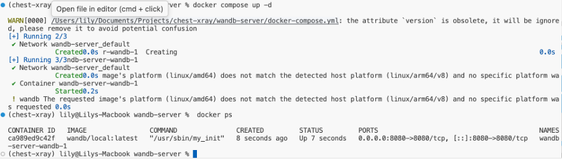
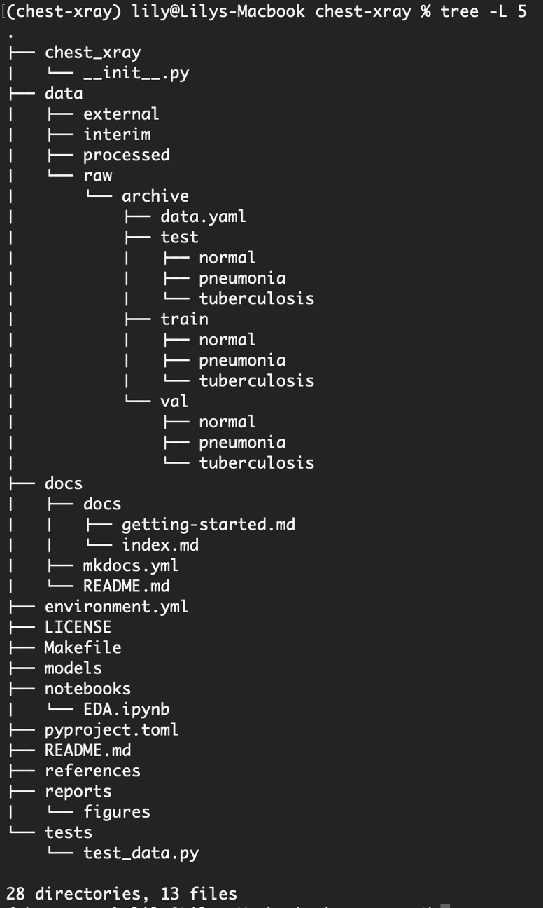

# Setup Guide — Training Environment

← Back to [Main README](../README.md)


This guide describes how to set up the **local training environment** for the Chest X-Ray Classification project.  
It follows the **Cookiecutter Data Science (CCDS)** template and focuses **only on training and experimentation**, not deployment or inference.

---

## 1. Project Structure Philosophy

This project follows the **Cookiecutter Data Science (CCDS)** template to ensure:

- Reproducibility
- Clear separation of concerns
- Scalable experimentation
- Industry-standard layout

Reference:  
https://cookiecutter-data-science.drivendata.org/

---

## 2. Prerequisites

### Operating System
- macOS (tested)
- Linux (Ubuntu 20.04+ recommended)

### Required Tools
- Python 3.10
- Conda (Miniconda or Anaconda)
- Docker (required for experiment tracking services)
- pipx (recommended for CCDS)

---

## 3. Install Cookiecutter Data Science (CCDS)

### Install `pipx`
```bash
brew install pipx
pipx ensurepath
# Install CCDS
pipx install cookiecutter-data-science

```
### 4. Create the Project Directory
```bash
mkdir -p ~/Documents/Projects
cd ~/Documents/Projects
ccds
```
When prompted, name the project: chest-xray


### 5. Create the Conda Environment
Navigate into the project directory & create Conda environment and Register Jupyter Kernel
```bash 
cd chest-xray
conda env create -f environment.yml
conda activate chest-xray
python -m ipykernel install \
  --user \
  --name chest-xray \
  --display-name "Python (chest-xray)"
``` 

### 6. Experiment Tracking Setup
Both are configured locally, without external cloud dependencies.
| Tool   | Purpose                                                  |
| ------ | -------------------------------------------------------- |
| MLflow | Parameter logging, artifact storage, best-model tracking |
| W&B    | Config management, metrics visualization, charts         |

### 7. MLflow (Local)
Tracking parameters
Logging metrics
Storing artifacts
Selecting best runs
```text
mlruns/
mlflow.db
``` 
ML Flow installation: https://mlflow.org/docs/latest/ml/tracking/quickstart/
And Start ML Flow locally ; Please change the path to your folder structure! 
```bash 
mlflow ui \
  --backend-store-uri sqlite:////Users/lily/Documents/Projects/chest-xray/mlflow.db \
  --port 5000
``` 

### 8. Weights & Biases (W&B) — Local Offline Setup
To ensure data privacy and offline operation, W&B is configured to run locally via Docker.
Download and install Docker Desktop for macOS:
https://www.docker.com/products/docker-desktop/

```bash
docker --version
wandb offline
export WANDB_MODE=offline
mkdir -p ~/wandb-server
cd ~/wandb-server
nano docker-compose.yml
docker compose up -d
``` 

Verify the server is running
```bash
http://localhost:8080
``` 

- Configure Environment Variable
```bash
export WANDB_BASE_URL=http://localhost:8080
``` 



Finally we are ready to move the development stage


Alternatively, clone my repo and ready to build the system.

I used macOS, therefore the folder paths and graphics are tailored to a Mac setup.