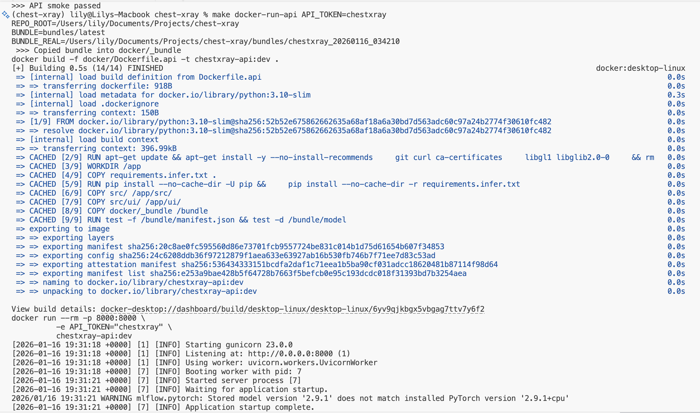
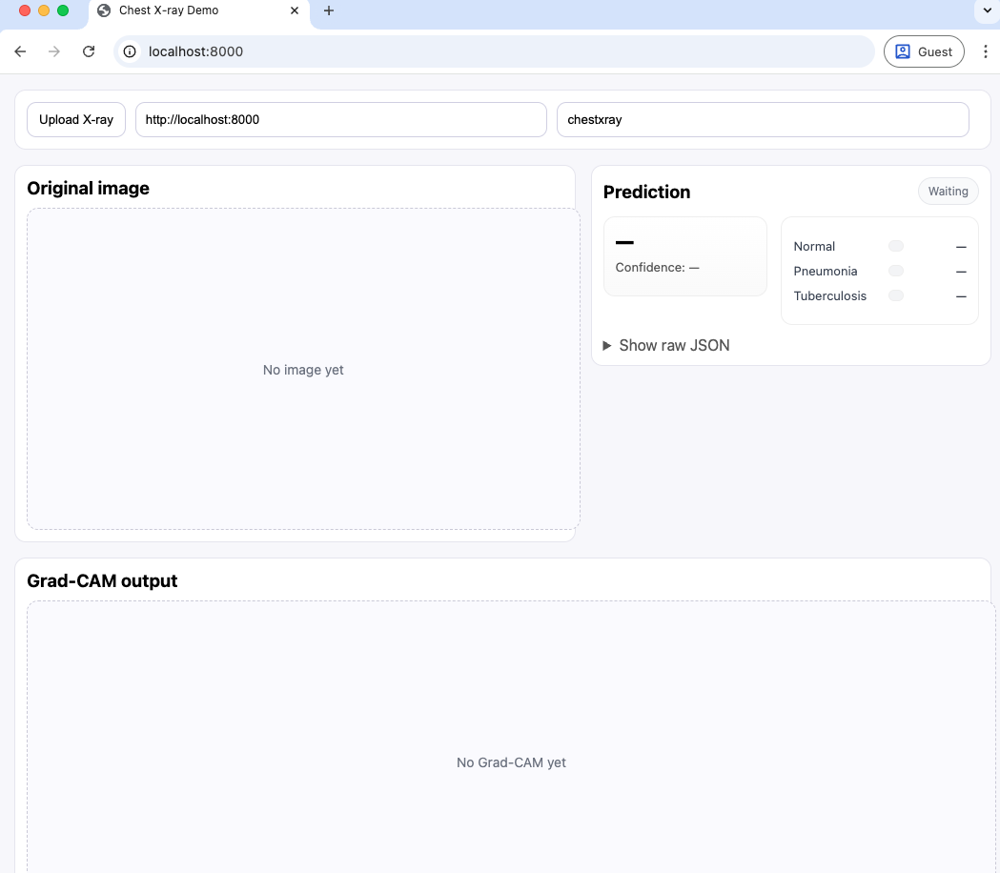

# Workflow Guide — Training, Evaluation, and Deployment

← Back to [Main README](../README.md)

This document describes the **end-to-end workflow** for the Chest X-Ray Classification project, covering:
- Reproducibility guarantees
- Data preprocessing
- Model training and evaluation
- Error analysis and explainability
- Model bundling and Docker-based deployment

All major steps are exposed through **Makefile targets** to ensure consistency and reproducibility.

---

## 1. Reproducibility

Reproducibility is enforced throughout the pipeline by controlling all major sources of randomness.

Key principles:
- Fixed random seeds across training, evaluation, and inference
- Deterministic configurations where supported by the framework
- All experiments tracked via **MLflow**
- Best models selected automatically — no manual checkpoint selection

As a result, experiments can be reliably reproduced across runs and environments.

---

## 2. Data Preparation and Preprocessing

### Raw Data Extraction

Raw data is stored under:

```text
data/raw/
```
This directory is treated as read-only.
### 2.1 Raw Data Extraction
Preprocessing decisions are driven by systematic EDA conducted in the following notebooks:
```text
01.EDA.ipynb
``` 
- Dataset overview
- Class distribution
- Image resolution and aspect ratios
```text
02.Preprocessing_Blackborder.ipynb
```
- Identification of black border artifacts & visualze images
- Border removal validation
```text
03.EDA_FinalizePreprocessing.ipynb
```
- Inspection after Step2 : border removal again check Contrast and exposure 
- CLAHE evaluation
- Final preprocessing decisions
Related Plots can be found here [EDA_Step1-3](../reports/EDA_Step1-3/) 

## 3. Model Training

The project supports multiple model families to explore different modeling assumptions and performance trade-offs.
### 3.1 Supported Model Families

- CNN (end-to-end deep learning)
- Backbone (Resnet, Densenet, EfficientNet and SwinTiny) + Linear Probe 
- Classical pipelines : HOG feature extractor + MLP / XGBoost / Random Forest
All training runs are logged to MLflow for automated comparison.

### 3.2 Training Commands
Train CNN
```bash
make train --cfg configs/cnn.yaml
``` 
Train Linear Probe
```bash
make probe_one --cfg configs/resnet50.yaml
make probe_one --cfg configs/densenet121.yaml
make probe_one --cfg configs/swin_tiny_patch4_window7_224.yaml
``` 
Train HOG Baseline
```bash
make train_hog
``` 

## 4. Evaluation and Inference (Best Models)
### Evaluate Best Models
```bash 
make eval-best
``` 
This step:
- Selects best-performing runs from MLflow
- Loads corresponding model checkpoints and configurations
- Evaluates on the held-out test set
Generates:
- Predictions and probability outputs
- Metrics and plots
- Operating-point thresholds and decision policies
All trails result will be stored in  [Best Models Ranking](../reports/best_model_b01/) 
Best Model will be saved! [Best Models](../reports/best_model_b01/best_model_meta.json) 
Best policy based threshold will be saved [Best Models](../reports/best_model_b01/cnn__cnn-30-flip-clahe/thresholds_policy.json)  


## 5. Post-hoc Error Analysis
```bash 
make analyze-best
``` 
This step performs structured error analysis, including:
- Parsing class names and decision thresholds
- Validation of prediction and probability files
- Generation of:
1) Confusion error taxonomy
2) High-risk clinical errors (e.g., Tuberculosis → Normal)
3) Per-class probability distributions
4) Borderline cases near decision thresholds
Results are exported as structured CSV and JSON files under: [Best Models Analysis](../reports/best_model_b01/cnn__cnn-30-flip-clahe/analysis/) 

# 6. Grad-CAM Analysis

Grad-CAM is used to assess model explainability and clinical plausibility.
Using curated case lists from error analysis, Grad-CAM heatmaps are generated for specific scenarios.
Note we processed by batch here. 
From previous step we have already generated follwing categories [For GradCamVisualization](../reports/best_model_b01/cnn__cnn-30-flip-clahe/analysis/viz_cases/)

### For High-risk Targets: 
```bash 
make gradcam-tb-fn-true
make gradcam-tb-fn-pred
make gradcam-tb-fp-pred
``` 
### For Borderline cases
```bash 
make gradcam-tb-borderline-fixed
make gradcam-tb-borderline-topk2
``` 
### We also want to visualze those Correct, high-confidence predictions
```bash 
make gradcam-correct-normal
make gradcam-correct-pna
make gradcam-correct-tb
``` 
#### [Results - GradCam Analysis](../reports/best_model_b01/cnn__cnn-30-flip-clahe/gradcam_correct_normal/) 

# 7. Deployment — Model Bundle

We then lock best model bundle, it is a self-contained, deployment-ready artifact created from the best training run.
We saved 
- Model weights
- Model configuration
- Class names
- Preprocessing metadata
- decision policy thresholds
- Run metadata for traceability

### Create the Best Model Bundle
``` bash
make bundle-best
```
This will be copied into the Docker folder and baked into the image, so we use consistent naming instead of timestamps by creating a symlink:
``` text
bundles/latest → newest bundle
```
From this point onward, models and its artifacts will be downloaded from MLFlow and save into [BundleFolder](../bundles/) 

# 8. Dockerized Inference
After bundling, the model is embedded into a Docker image to produce a fully self-contained inference artifact.

#### Build Inference Docker Image

Lightweight [requirements.infer.txt](../requirements.infer.txt) is created for a slim Docker inference-only image. 
```bash
make docker-build-infer
```
We want a self-contained Docker image. Therefore, the configuration in [Dockerfile.infer](../docker/Dockerfile.infer) 
 bundles the model into the image and produces a standalone inference container.

```bash
make docker-smoke-baked
```
This verifies successful bundle loading, inference execution inside Docker, and valid JSON output.

# 9. Docker-Based Inference (Standalone)
Docker inference simulates production-equivalent conditions and is independent of the local Python environment.
Local vs Docker Inference
| Mode             | Description                                  |
| ---------------- | -------------------------------------------- |
| `infer-*`        | Runs locally using Python environment        |
| `docker-infer-*` | Runs fully inside Docker using bundled model |


#### Inference
#### Local


#### Docker 
##### Single Image 
```bash
make docker-infer-one IMG=/path/to/image.jpg
```
##### Folder-Based Inference
```bash
make docker-infer-folder IMG_DIR=/path/to/image_folder
```

# 10. CI / Production Readiness
### CI Smoke Test
```bash
make ci-smoke
```
We will see 
```text
CI smoke gate passed
``` 
If this passes the CI smoke test, it confirms that the pipeline is reproducible, fully bundled, Docker-compatible, and deployment-ready.

# 11. Fast API Deployment 
Finally, instead of using the CLI in Docker, we decided to build a UI for inference. The UI allows users to load an image, run the model inference, and view both the predicted output and the Grad-CAM visualization. This makes it easier to quickly validate model behavior, interpret predictions, and inspect model attention at a glance.

To design production-ready FastAPI inference server (prediction + Grad-CAM) packaged as a Docker image.

We will need to build API Image in docker 
```bash
make docker-build-api
```
it will produces: 
```bash
chestxray-api:dev
``` 
After it has successfully built, we can run API locally 
```bash
make docker-run-api API_TOKEN=chestxray
```

We use a simple API token–based authentication mechanism implemented directly in [app.py](../src/api/app.py), where a static API token ("chestxray") is configured and validated on incoming requests.



#### Test End points Manually

##### Prediction

```bash
curl -H "Authorization: Bearer chestxray" \
  -F "file=@data/raw/archive/test/tuberculosis/tuberculosis-828.jpg" \.  
  http://localhost:8000/predict

``` 

##### Grad-CAM

```bash
curl -H "Authorization: Bearer chestxray" \
  -F "file=@data/raw/archive/test/tuberculosis/tuberculosis-828.jpg" \
  http://localhost:8000/grad_cam \
  --output cam.png

``` 

We can also perform HealthCheck
```bash
make docker-api-health
``` 

Expected:

```text
curl -fsS "http://localhost:8000/health" | python -m json.tool
{
    "status": "ok",
    "model_loaded": true
}
```


On browser: 
```bash
http://localhost:8000/
```



Free free to use UI for inference 

Eg:


Finally, we are ready to export Image 

```bash
make docker-api-save
```

Output will be save to dist/ 
```text
Saving image chestxray-api:dev -> dist/chestxray-api_dev.tar.gz
-rw-r--r--@ 1 lily  staff   504M Jan 16 14:45 dist/chestxray-api_dev.tar.gz
```

# 12. Deployment 

#### Copy chestxray-api_dev.tar.gz to desired server 

#### Load Image on Server 
Make sure Server has already installed Docker Software.

```bash
docker load < chestxray-api_dev.tar.gz 
``` 

Check if docker is successfully imported. 
```bash
docker ps 
``` 

Lastly we run it on Server

```bash
docker run -d --restart unless-stopped \
  --name chestxray-api \
  -p 8000:8000 \
  -e API_TOKEN="chestxray" \
  chestxray-api:dev
```


I have tested this file on both macOS and Windows. Windows takes slightly longer, but it works correctly. I do not have a Linux PC, so it has not been tested there.
